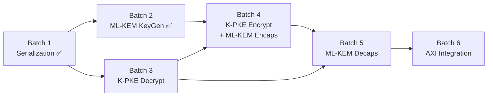

# ML-KEM-768 RTL Implementation — Full Roadmap (Batch 1→6)

## Dependency Graph (Topological Order)



> [!IMPORTANT]
> **Tại sao Bảng 1 đúng, Bảng 2 sai:**
> - Bảng 2 đặt "ML-KEM wrappers (KeyGen+Encaps+Decaps)" vào Batch 5 →
>   nhưng ML-KEM KeyGen wrapper **đã xong** trong Batch 2 (`ml_kem_keygen.v` gộp K-PKE + wrapping).
> - ML-KEM Encaps chỉ là thin wrapper quanh K-PKE.Encrypt → gộp vào Batch 4 hợp lý.
> - ML-KEM Decaps cần CẢ Decrypt + Encrypt (re-encryption check) → đúng phải là Batch 5 riêng.

---

## Batch 1 — Serialization ✅ DONE

| Module | Status |
|--------|--------|
| `poly_compress.v` | ✅ Verified |
| `poly_decompress.v` | ✅ Verified |
| `poly_tobytes.v` | ✅ Verified |
| `poly_frombytes.v` | ✅ Verified |

---

## Batch 2 — ML-KEM KeyGen ✅ VERIFIED (P6-safe-4, Phase 7 complete)

| Module | Status |
|--------|--------|
| `ml_kem_keygen.v` | ✅ Verified (Phase 7 FSM Refactored, P6-safe-4) |
| `tb_ml_kem_keygen.sv` | ✅ Verified (100/100 KAT Full Flow Passed) |

**FIPS 203 Ref:** Algorithm 16 (ML-KEM.KeyGen) bao gồm Algorithm 13 (K-PKE.KeyGen)

---

## Batch 3 — K-PKE Decrypt

**FIPS 203 Ref:** Algorithm 15 (K-PKE.Decrypt)

### Thuật toán
```
Input:  dk_PKE = ByteEncode_12(ŝ)     (1152 bytes = 3 × 384)
        c = (c1 || c2)                 (1088 bytes = 3×320 + 128)

1. u[i] = Decompress_d_u(c1_i)         for i = 0..2    (d_u = 10)
2. v    = Decompress_d_v(c2)                            (d_v = 4)
3. ŝ[i] = ByteDecode_12(dk_i)          for i = 0..2
4. û[i] = NTT(u[i])                    for i = 0..2
5. w    = INTT(ŝ^T · û)               = INTT(Σ ŝ[i]·û[i])
6. m    = Compress_1(v - w)

Output: m (32 bytes)
```

### Trạng thái thực tế
| Module | Status |
|--------|--------|
| `kpke_decrypt.v` | DONE - Verified (KAT 100/100 pass, TB_REV 2026-04-18 full-kat-default) |
| `tb_kpke_decrypt.sv` | DONE - Verified (default MAX_KATS=100, plusarg override supported) |

> [!NOTE]
> Batch 3 closure evidence:
> - sim_decrypt_20260418_114128: ALL TESTS PASSED: 100 KAT vectors.
> - sim_decrypt_20260418_112811: ALL TESTS PASSED: 100 KAT vectors.
> - Status: READY for Batch 4/5 integration.

### Phan tich `kpke_decrypt.v`
**Lý do tách riêng:** Module này được Batch 5 (Decaps) gọi trực tiếp. Giữ riêng để tái sử dụng.

**IP Cores instantiate bên trong:**
- 1× `ntt_top`
- 1× `inv_ntt_top` ← **Module mới cần dùng** (Batch 2 chỉ dùng NTT thuận)
- 1× `poly_pointwise_top`
- 1× `poly_add_sub_top`
- 1× `poly_decompress`
- 1× `poly_frombytes`
- 1× `poly_compress` (d=1 cho bước cuối)

> **Không cần** `keccak_sponge_top` — Decrypt không hashing.

**BRAM nội bộ:**
- 3× BRAM18K cho `s_hat[3]` (giải mã từ dk)
- 3× BRAM18K cho `u_hat[3]` (NTT của u đã giải nén)
- 1× BRAM18K cho `acc` (tích lũy pointwise)
- **Tổng: 7× BRAM18K**

**FSM States:**
```
S_IDLE → S_DECODE_SK (frombytes × 3) → S_DECOMPRESS_U (decompress_10 × 3)
→ S_DECOMPRESS_V (decompress_4) → S_NTT_U (NTT × 3) 
→ S_POINTWISE_ACC (pointwise + add × 3) → S_INTT_W (INTT)
→ S_SUB_V_W (v - w) → S_COMPRESS_MSG (compress_1) → S_DONE
```

**Cycle Estimate:** ~11,000 cycles (~110 µs @ 100MHz)

#### [NEW] `tb_kpke_decrypt.sv`
- KAT test: Cho `dk_PKE` + `ciphertext` → verify `message` khớp golden

---

## Batch 4 — K-PKE Encrypt + ML-KEM Encaps

**FIPS 203 Ref:** Algorithm 14 (K-PKE.Encrypt) + Algorithm 17 (ML-KEM.Encaps)

### Thuật toán K-PKE.Encrypt
```
Input:  ek_PKE = (t_hat_bytes || ρ)    (1184 bytes)
        m      (32 bytes)
        r      (32 bytes — randomness)

1. t̂[i] = ByteDecode_12(ek_i)          for i = 0..2
2. ρ    = ek[1152..1183]
3. r[i] = CBD_η2(PRF(r, i))            for i = 0..2, nonce = 0,1,2
4. e1[i]= CBD_η2(PRF(r, 3+i))          for i = 0..2, nonce = 3,4,5
5. e2   = CBD_η2(PRF(r, 6))            nonce = 6
6. r̂[i] = NTT(r[i])                    for i = 0..2
7. u[i] = INTT(Â^T[i] · r̂) + e1[i]    for i = 0..2
   → Â^T[i][j] = SampleNTT(XOF(ρ || i || j))   ⚠️ TRANSPOSE: i trước j
8. v    = INTT(t̂^T · r̂) + e2 + encode(m)
9. c1[i]= Compress_10(u[i])             for i = 0..2
10.c2   = Compress_4(v)

Output: c = (c1 || c2)                 (1088 bytes)
```

> [!CAUTION]
> **XOF Index cho Encrypt KHÁC KeyGen!**
> - KeyGen: `Â[i,j] = SampleNTT(XOF(ρ, j, i))` → `ρ || j || i`
> - Encrypt: `Â^T[i,j] = SampleNTT(XOF(ρ, i, j))` → `ρ || i || j`
>
> Encrypt tính `Â^T · r̂` (transpose) nên index ĐẢO so với KeyGen!
> Xác minh từ HLS `encaps.cpp` line 274: `xof_in[4] = (uint64_t)i | ((uint64_t)j << 8)`
> và `decaps.cpp` line 226: `xof_in[4] = (uint64_t)i | ((uint64_t)j << 8)`
> → Cả Encaps và Decaps đều dùng `i || j` (transpose convention).

### Module mới

#### [NEW] `kpke_encrypt.v`
**Lý do tách riêng:** Module này được cả Encaps (Batch 4) VÀ Decaps (Batch 5) gọi.

**IP Cores instantiate bên trong:**
- 1× `keccak_sponge_top` (SHAKE128 cho Â^T, SHAKE256 cho PRF)
- 1× `poly_cbd_eta2_top`
- 1× `ntt_top`
- 1× `inv_ntt_top`
- 1× `poly_parse_inline_top`
- 1× `poly_pointwise_top`
- 1× `poly_add_sub_top`
- 1× `poly_frombytes`
- 1× `poly_compress` (d=10 và d=4)
- 1× `poly_frommsg` ← **[NEW]** encode message (Decompress_1: bit→coeff×⌈q/2⌉)

**BRAM nội bộ:**
- 3× BRAM18K cho `r_hat[3]`
- 3× BRAM18K cho `e1[3]`
- 1× BRAM18K cho `e2`
- 3× BRAM18K cho `t_hat[3]`
- 1× BRAM18K cho `acc / A_hat_buf`
- 1× BRAM18K cho `v_poly`
- **Tổng: 12× BRAM18K**

**FSM States:**
```
S_IDLE → S_DECODE_EK (frombytes × 3 + extract ρ)
→ S_GEN_R_LOOP (PRF + CBD + NTT × 3)
→ S_GEN_E1_LOOP (PRF + CBD × 3)
→ S_GEN_E2 (PRF + CBD)
→ S_CALC_U_LOOP (i=0..2, j=0..2: XOF(ρ||i||j) + Parse + PW + Add)
→ S_INTT_U + S_ADD_E1 (× 3)
→ S_CALC_V (t̂·r̂ PW+Add × 3, INTT, +e2, +encode(m))
→ S_COMPRESS_U (compress_10 × 3) → S_COMPRESS_V (compress_4)
→ S_DONE
```

**Cycle Estimate:** ~80,000 cycles (~800 µs @ 100MHz)

#### [NEW] `ml_kem_encaps.v`
Thin wrapper:
```
1. H(ek) = SHA3-256(pk)
2. (K, r) = G(m || H(ek)) = SHA3-512(m || H(ek))
3. c = K-PKE.Encrypt(ek, m, r)
4. Output: (K, c)
```

**IP Cores:**
- 1× `keccak_sponge_top` (SHA3-256 + SHA3-512)
- 1× `kpke_encrypt` (instantiate as sub-module)

#### [NEW] `tb_kpke_encrypt.sv`
- Roundtrip test: `Dec(Enc(m, ek, r), dk) == m` ← **Milestone quan trọng nhất**

#### [NEW] `tb_ml_kem_encaps.sv`
- KAT test: `(pk, randomness_m) → verify (ss, ct)` khớp golden

---

## Batch 5 — ML-KEM Decaps

**FIPS 203 Ref:** Algorithm 18 (ML-KEM.Decaps)

### Thuật toán
```
Input:  dk = (dk_PKE || ek || H(ek) || z)    (2400 bytes)
        c  = (c1 || c2)                       (1088 bytes)

1. m' = K-PKE.Decrypt(dk_PKE, c)
2. (K', r') = G(m' || H(ek))           = SHA3-512(m' || h)
3. c' = K-PKE.Encrypt(ek, m', r')      ← RE-ENCRYPTION
4. if c == c':                          ← CONSTANT-TIME COMPARE
     K = K'
   else:
     K = J(z || c)                     = SHAKE-256(z || c, 32)  ← IMPLICIT REJECTION
5. Output: K (32 bytes)
```

> [!WARNING]
> **Security-Critical Requirements:**
> - **Constant-time comparison** (step 4): XOR-accumulate ALL 1088 bytes, no early exit
> - **Implicit rejection** (step 4 else): Must use SHAKE-256(z || c) — NOT return error
> - **Both branches must execute** regardless of comparison result (no timing leak)

### Module mới

#### [NEW] `ml_kem_decaps.v`

**Kiến trúc quyết định: Shared-Core FSM**

Module Decaps cần chạy tuần tự: Decrypt → Re-Encrypt → Compare → Output.
Thay vì instantiate cả `kpke_decrypt` + `kpke_encrypt` (→ 2× tất cả IP cores, lãng phí),
dùng **1 bộ shared cores** với FSM điều phối 2 pha:

**IP Cores instantiate bên trong:**
- 1× `keccak_sponge_top`
- 1× `ntt_top`
- 1× `inv_ntt_top`
- 1× `poly_pointwise_top`
- 1× `poly_add_sub_top`
- 1× `poly_cbd_eta2_top`
- 1× `poly_parse_inline_top`
- 1× `poly_frombytes`
- 1× `poly_tobytes`
- 1× `poly_compress`
- 1× `poly_decompress`
- 1× `poly_frommsg` (encode m' cho re-encryption)

**BRAM nội bộ:**
- 3× BRAM18K cho `s_hat[3]`
- 3× BRAM18K cho `u_hat/r_hat[3]` (reuse giữa Decrypt và Encrypt)
- 1× BRAM18K cho `acc`
- 1× BRAM18K cho `v_poly`
- 1× BRAM18K cho `e2`
- Byte BRAM cho `ct_prime` (1088 bytes so sánh với ct_in)
- **Tổng: ~12× BRAM18K + 1× byte BRAM**

**FSM States (high-level):**
```
S_IDLE → S_UNPACK_SK (extract dk_PKE, ek, h, z)
→ [PHASE 1: DECRYPT] S_DECRYPT_* (reuse Batch 3 logic)
→ S_HASH_G (SHA3-512(m' || h) → K', r')
→ [PHASE 2: RE-ENCRYPT] S_ENCRYPT_* (reuse Batch 4 logic, output → ct_prime)
→ S_COMPARE (XOR-accumulate 1088 bytes, constant-time)
→ S_DERIVE_KEY (if fail: SHAKE-256(z || ct_in))
→ S_OUTPUT_K (conditional mux, constant-time select)
→ S_DONE
```

**Constant-Time Compare RTL:**
```verilog
reg [7:0] xor_acc;
always @(posedge clk) begin
    if (state == S_COMPARE_INIT)
        xor_acc <= 8'd0;
    else if (state == S_COMPARE)
        xor_acc <= xor_acc | (ct_in_byte ^ ct_prime_byte);  // NO early exit
end
wire compare_pass = (xor_acc == 8'd0);  // Only valid after ALL bytes
```

**Cycle Estimate:** ~99,000 cycles (~990 µs @ 100MHz)

#### [NEW] `tb_ml_kem_decaps.sv`
- Full KAT protocol test: `(sk, ct) → verify ss` khớp golden
- Implicit rejection test: tampered `ct` → verify output ≠ K' (uses z-derived fallback)

---

## Batch 6 — AXI Integration

### Top-Level Module

#### [NEW] `ml_kem_top.v`
AXI wrapper connecting PS ↔ PL:

```
PS (ARM A53) ←→ AXI4-Lite (Control) ←→ ml_kem_top
              ←→ AXI4-MM (Data)     ←→ DDR / BRAM
```

**AXI4-Lite Register Map:**
| Offset | Name | R/W | Description |
|--------|------|-----|-------------|
| 0x00 | CTRL | W | [0] start, [1] op_sel (0=KeyGen, 1=Encaps, 2=Decaps) |
| 0x04 | STATUS | R | [0] done, [1] idle |
| 0x08 | CYCLES | R | Performance counter |
| 0x10 | SEED_D_LO | W | seed_d[63:0] |
| ... | ... | ... | ... |

**IP Cores instantiate bên trong:**
- 1× `ml_kem_keygen`
- 1× `ml_kem_encaps` 
- 1× `ml_kem_decaps`
- AXI4-Lite slave FSM
- AXI4-MM master FSM (burst read/write DDR)

**Verification:**
- PS-driven test via PYNQ / bare-metal C
- End-to-end: KeyGen → Encaps → Decaps → verify shared secret match

---

## Tổng kết Resource Budget (Ước tính)

| Resource | Batch 2 | Batch 3 | Batch 4 | Batch 5 | Batch 6 | ZU5EV Total | % Used |
|----------|---------|---------|---------|---------|---------|-------------|--------|
| BRAM18K  | 14      | 7       | 12      | 13      | ~5      | 288         | ~18%   |
| DSP48E2  | 3       | 3       | 3       | 3       | 0       | 96          | ~12%   |
| LUT      | ~15K    | ~12K    | ~18K    | ~18K    | ~3K     | 117K        | ~56%   |
| FF       | ~8K     | ~6K     | ~10K    | ~10K    | ~2K     | 234K        | ~15%   |

> [!NOTE]
> Các con số trên giả định Resource-per-function (mỗi module có IP cores riêng).
> Nếu cần giảm area, có thể share cores ở Batch 6 top level (nhưng tăng complexity FSM).

