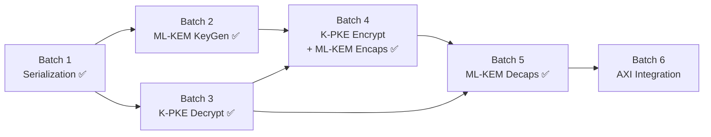

# ML-KEM-768 RTL Implementation — Full Roadmap (Batch 1→6)

> **Status update (2026-04-27, v9):** Tất cả 6 batches đã đóng. Final state RTL track:
> - **KAT 100/100 PASS on-board** (KR260 ZU5EV, 3 notebooks cross-check)
> - **LUT 25,590 (21.85%)** sau 9 phases tối ưu (v6 Phase C global keccak share + v9 Option D global kpke_encrypt share)
> - **WNS +2.605 ns @ 100 MHz**
> - Latency: KeyGen 645.8 µs / Encaps 861.1 µs / Decaps 1273 µs
> - Final architecture **vượt qua "Shared-Core" target ban đầu** — lifted singleton instances cho cả Keccak và kpke_encrypt tại `ml_kem_top` (giảm ~30k LUT keccak share + 8k LUT encrypt share).
> - Tham khảo runbook v9: `docs/aZ/source code aZ/batch 6+ - Area optimization/2026-04-21__batch6-ooc-qor-runbook.md`

## Dependency Graph (Topological Order)



> [!IMPORTANT]
> **Tại sao Bảng 1 đúng, Bảng 2 sai:**
> - Bảng 2 đặt "ML-KEM wrappers (KeyGen+Encaps+Decaps)" vào Batch 5 →
>   nhưng ML-KEM KeyGen wrapper **đã xong** trong Batch 2 (`ml_kem_keygen.v` gộp K-PKE + wrapping).
> - ML-KEM Encaps chỉ là thin wrapper quanh K-PKE.Encrypt → gộp vào Batch 4 hợp lý.
> - ML-KEM Decaps cần CẢ Decrypt + Encrypt (re-encryption check) → đúng phải là Batch 5 riêng.

---

## Batch 1 — Serialization ✅ DONE

| Module | Status |
|--------|--------|
| `poly_compress.v` | ✅ Verified |
| `poly_decompress.v` | ✅ Verified |
| `poly_tobytes.v` | ✅ Verified |
| `poly_frombytes.v` | ✅ Verified |

---

## Batch 2 — ML-KEM KeyGen ✅ VERIFIED (P6-safe-4, Phase 7 complete)

| Module | Status |
|--------|--------|
| `ml_kem_keygen.v` | ✅ Verified (Phase 7 FSM Refactored, P6-safe-4) |
| `ml_kem_keygen_io_wrapper.v` | ✅ Synthesis/Implementation IO wrapper |
| `tb_ml_kem_keygen.sv` | ✅ Verified (100/100 KAT Full Flow Passed) |
| `tb_ml_kem_keygen_wrapper.sv` | ✅ Verified (100/100 KAT Wrapper Flow Passed) |

**FIPS 203 Ref:** Algorithm 16 (ML-KEM.KeyGen) bao gồm Algorithm 13 (K-PKE.KeyGen)

---

## Batch 3 — K-PKE Decrypt

**FIPS 203 Ref:** Algorithm 15 (K-PKE.Decrypt)

### Thuật toán
```
Input:  dk_PKE = ByteEncode_12(ŝ)     (1152 bytes = 3 × 384)
        c = (c1 || c2)                 (1088 bytes = 3×320 + 128)

1. u[i] = Decompress_d_u(c1_i)         for i = 0..2    (d_u = 10)
2. v    = Decompress_d_v(c2)                            (d_v = 4)
3. ŝ[i] = ByteDecode_12(dk_i)          for i = 0..2
4. û[i] = NTT(u[i])                    for i = 0..2
5. w    = INTT(ŝ^T · û)               = INTT(Σ ŝ[i]·û[i])
6. m    = Compress_1(v - w)

Output: m (32 bytes)
```

### Trạng thái thực tế
| Module | Status |
|--------|--------|
| `kpke_decrypt.v` | DONE - Verified (KAT 100/100 pass, TB_REV 2026-04-18 full-kat-default) |
| `tb_kpke_decrypt.sv` | DONE - Verified (default MAX_KATS=100, plusarg override supported) |

> [!NOTE]
> Batch 3 closure evidence:
> - sim_decrypt_20260418_114128: ALL TESTS PASSED: 100 KAT vectors.
> - sim_decrypt_20260418_112811: ALL TESTS PASSED: 100 KAT vectors.
> - Status: READY for Batch 4/5 integration.

### Phan tich `kpke_decrypt.v`
**Lý do tách riêng:** Module này được Batch 5 (Decaps) gọi trực tiếp. Giữ riêng để tái sử dụng.

**IP Cores instantiate bên trong:**
- 1× `ntt_top`
- 1× `inv_ntt_top` ← **Module mới cần dùng** (Batch 2 chỉ dùng NTT thuận)
- 1× `poly_pointwise_top`
- 1× `poly_add_sub_top`
- 1× `poly_decompress`
- 1× `poly_frombytes`
- 1× `poly_compress` (d=1 cho bước cuối)

> **Không cần** `keccak_sponge_top` — Decrypt không hashing.

**BRAM nội bộ (Phase-2 completed):**
- 2× BRAM18K cho `dk_buf` (1152×8) + `ct_buf` (1088×8)
- 2× BRAM18K cho `s_hat_mem0/1` (384×16 mỗi bank, 3 polynomials × 128 pairs)
- 2× BRAM18K cho `u_poly_mem0/1` (384×16 mỗi bank)
- 1× BRAM18K cho `u_hat_mem` (768×16)
- 2× BRAM18K cho `v_mem0/1` (128×16 mỗi bank)
- 1× BRAM18K cho `acc_mem` (256×16)
- 1× BRAM18K cho `tmp_mem` (256×16)
- 1× BRAM18K cho `w_mem` (256×16)
- 2× BRAM18K cho `diff_mem0/1` (128×16 mỗi bank)
- **Tổng standalone: 28× RAMB18E2** (14 từ kpke_decrypt + 12 từ IP cores + 2 auto-inferred)
- Memory process tách riêng khỏi FSM, synchronous read với prefetch states

**FSM States (47 total, including 9 prefetch states):**
```
S_IDLE → S_DECODE_SK (frombytes × 3) → S_DECOMPRESS_U (decompress_10 × 3)
→ S_DECOMPRESS_V (decompress_4) → S_NTT_LOAD_PREF → S_NTT_U (NTT × 3)
→ S_PW_LOAD_A/B_PREF → S_POINTWISE_ACC (pointwise + add × 3)
→ S_INTT_LOAD_PREF → S_INTT_W (INTT)
→ S_SUB_LOAD_A/B_PREF → S_SUB_V_W (v - w)
→ S_COMP_PREF → S_COMPRESS_MSG (compress_1) → S_DONE
```

**Cycle Estimate:** ~21,060 cycles (~211 µs @ 100MHz) — measured post-Phase-2 BRAM refactor (100/100 KAT PASS, +60 cycles from prefetch states)

#### [NEW] `tb_kpke_decrypt.sv`
- KAT test: Cho `dk_PKE` + `ciphertext` → verify `message` khớp golden

---

## Batch 4 — K-PKE Encrypt + ML-KEM Encaps

**FIPS 203 Ref:** Algorithm 14 (K-PKE.Encrypt) + Algorithm 17 (ML-KEM.Encaps)
**Trạng thái:** DONE - VERIFIED (Encaps full KAT pass, 2026-04-19)

### Trạng thái thực tế
| Module | Trạng thái |
|--------|--------|
| `kpke_encrypt.v` | DONE - Verified qua integrated Encaps KAT run (100/100 pass) |
| `ml_kem_encaps.v` | DONE - Verified (100/100 encaps KAT pass) |
| `tb_kpke_encrypt.sv` | READY - chưa có standalone rerun trong môi trường CLI hiện tại |
| `tb_ml_kem_encaps.sv` | DONE - Verified (MAX_KATS=100, all pass) |

> [!NOTE]
> Bằng chứng closure Batch 4:
> - Terminal run 2026-04-19 (`tb_ml_kem_encaps`): `KAT #1..#100 PASSED`, `ALL TESTS PASSED: 100 encaps KAT vectors`.
> - Debug line tại KAT1: `DBG KAT1 hash h[0..3]=f5 72 62 66 ss[0..3]=ac 86 5f 83`.
> - Trong CLI container hiện tại không có `vivado/xsim`, nên standalone `tb_kpke_encrypt` được track qua integrated Encaps KAT.

### Thuật toán K-PKE.Encrypt
```
Input:  ek_PKE = (t_hat_bytes || ρ)    (1184 bytes) (t_hat_bytes (1152 bytes) + ρ (32 bytes) )
        m      (32 bytes)
        r      (32 bytes — randomness)

1. t̂[i] = ByteDecode_12(ek_i)          for i = 0..2
2. ρ    = ek[1152..1183]
3. r[i] = CBD_η2(PRF(r, i))            for i = 0..2, nonce = 0,1,2
4. e1[i]= CBD_η2(PRF(r, 3+i))          for i = 0..2, nonce = 3,4,5
5. e2   = CBD_η2(PRF(r, 6))            nonce = 6
6. r̂[i] = NTT(r[i])                    for i = 0..2
7. u[i] = INTT(Â^T[i] · r̂) + e1[i]    for i = 0..2
   → Â^T[i][j] = SampleNTT(XOF(ρ || i || j))   ⚠️ TRANSPOSE: i trước j
8. v    = INTT(t̂^T · r̂) + e2 + encode(m)
9. c1[i]= Compress_10(u[i])             for i = 0..2
10.c2   = Compress_4(v)

Output: c = (c1 || c2)                 (1088 bytes)
```

> [!CAUTION]
> **XOF Index cho Encrypt KHÁC KeyGen!**
> - KeyGen: `Â[i,j] = SampleNTT(XOF(ρ, j, i))` → `ρ || j || i`
> - Encrypt: `Â^T[i,j] = SampleNTT(XOF(ρ, i, j))` → `ρ || i || j`
>
> Encrypt tính `Â^T · r̂` (transpose) nên index ĐẢO so với KeyGen!
> Xác minh từ HLS `encaps.cpp` line 274: `xof_in[4] = (uint64_t)i | ((uint64_t)j << 8)`
> và `decaps.cpp` line 226: `xof_in[4] = (uint64_t)i | ((uint64_t)j << 8)`
> → Cả Encaps và Decaps đều dùng `i || j` (transpose convention).

### Module mới

#### [NEW] `kpke_encrypt.v`
**Lý do tách riêng:** Module này được cả Encaps (Batch 4) VÀ Decaps (Batch 5) gọi.

**IP Cores instantiate bên trong:**
- 1× `keccak_sponge_top` (SHAKE128 cho Â^T, SHAKE256 cho PRF)
- 1× `poly_cbd_eta2_top`
- 1× `ntt_top`
- 1× `inv_ntt_top`
- 1× `poly_parse_inline_top`
- 1× `poly_pointwise_top`
- 1× `poly_add_sub_top`
- 1× `poly_frombytes`
- 1× `poly_compress` (d=10 và d=4)
- 1× `poly_frommsg` ← **[NEW]** encode message (Decompress_1: bit→coeff×⌈q/2⌉)

**BRAM nội bộ:**
- 3× BRAM18K cho `r_hat[3]`
- 3× BRAM18K cho `e1[3]`
- 1× BRAM18K cho `e2`
- 3× BRAM18K cho `t_hat[3]`
- 1× BRAM18K cho `acc / A_hat_buf`
- 1× BRAM18K cho `v_poly`
- **Tổng: 12× BRAM18K**

**FSM States:**
```
S_IDLE → S_DECODE_EK (frombytes × 3 + extract ρ)
→ S_GEN_R_LOOP (PRF + CBD + NTT × 3)
→ S_GEN_E1_LOOP (PRF + CBD × 3)
→ S_GEN_E2 (PRF + CBD)
→ S_CALC_U_LOOP (i=0..2, j=0..2: XOF(ρ||i||j) + Parse + PW + Add)
→ S_INTT_U + S_ADD_E1 (× 3)
→ S_CALC_V (t̂·r̂ PW+Add × 3, INTT, +e2, +encode(m))
→ S_COMPRESS_U (compress_10 × 3) → S_COMPRESS_V (compress_4)
→ S_DONE
```

**Cycle Estimate:** ~80,000 cycles (~800 µs @ 100MHz)

#### [NEW] `ml_kem_encaps.v`
Thin wrapper:
```
1. H(ek) = SHA3-256(pk)
2. (K, r) = G(m || H(ek)) = SHA3-512(m || H(ek))
3. c = K-PKE.Encrypt(ek, m, r)
4. Output: (K, c)
```

**IP Cores:**
- 1× `keccak_sponge_top` (SHA3-256 + SHA3-512)
- 1× `kpke_encrypt` (instantiate as sub-module)

#### [NEW] `tb_kpke_encrypt.sv`
- Roundtrip test: `Dec(Enc(m, ek, r), dk) == m` ← **Milestone quan trọng nhất**

#### [NEW] `tb_ml_kem_encaps.sv`
- KAT test: `(pk, randomness_m) → verify (ss, ct)` khớp golden

---

## Batch 5 — ML-KEM Decaps ✅ VERIFIED

**FIPS 203 Ref:** Algorithm 18 (ML-KEM.Decaps)
**Trạng thái:** DONE - VERIFIED (100/100 KAT pass + 100/100 implicit rejection pass, 2026-04-19)

### Trạng thái thực tế
| Module | Trạng thái |
|--------|--------|
| `ml_kem_decaps.v` | DONE - Verified (100/100 KAT pass, match + fail branches, constant-time Δ=0) |
| `tb_ml_kem_decaps.sv` | DONE - Verified (MAX_KATS=100, dual-run match/fail per KAT, timing check) |
| Tiền đề (`kpke_decrypt.v`) | DONE - Verified (100/100 KAT pass) |
| Tiền đề (`kpke_encrypt.v`) | DONE - Verified (qua integrated Encaps + Decaps KAT runs) |

> [!NOTE]
> Bằng chứng closure Batch 5:
> - `tb_ml_kem_decaps` run 2026-04-19: `KAT #1..#100 PASSED`, `ALL TESTS PASSED: 100 decaps KAT vectors`.
> - Mỗi KAT chạy 2 lần: match (ct gốc → ss == exp_ss) + fail (ct_tampered → ss == K_reject).
> - Constant-time: Δ cycles = 0 cho tất cả 100 vectors (TIMING_DELTA_MAX=10, actual=0).
> - Implicit rejection: `ct_tampered[0] ^= 8'hFF`, output verified == `dut.k_reject` (SHAKE-256(z||ct)).
> - Zeroization: m', r', K' cleared in S_ZEROIZE state.
> - Clean exit: `$finish` at tb line 282, no `$fatal`.

### Thuật toán
```
Input:  dk = (dk_PKE || ek || H(ek) || z)    (2400 bytes)
        c  = (c1 || c2)                       (1088 bytes)

1. m' = K-PKE.Decrypt(dk_PKE, c)
2. (K', r') = G(m' || H(ek))           = SHA3-512(m' || h)
3. c' = K-PKE.Encrypt(ek, m', r')      ← RE-ENCRYPTION
4. if c == c':                          ← CONSTANT-TIME COMPARE
     K = K'
   else:
     K = J(z || c)                     = SHAKE-256(z || c, 32)  ← IMPLICIT REJECTION
5. Output: K (32 bytes)
```

> [!WARNING]
> **Security-Critical Requirements (ALL MET ✅):**
> - **Constant-time comparison** (step 4): XOR-accumulate ALL 1088 bytes, no early exit ✅
> - **Implicit rejection** (step 4 else): SHAKE-256(z || c) output verified ✅
> - **Both branches execute** regardless of comparison result (Δ=0 cycles) ✅
> - **Zeroization**: m', r', K' cleared after operation ✅

---

### ✅ Kiến trúc hiện tại (Verified): Dual-Instantiation Orchestrator

> Implementation thực tế dùng **dual-instantiation** — instantiate riêng `kpke_decrypt` + `kpke_encrypt`
> + 1× `keccak_sponge_top` (cho SHA3-512/SHAKE-256 ở top level).
> FSM top-level chỉ orchestrate: preload → decrypt → hash → preload → encrypt → compare → output.

#### `ml_kem_decaps.v` (current)

**IP Cores instantiate bên trong:**
- 1× `keccak_sponge_top` (SHA3-512 cho G, SHAKE-256 cho J)
- 1× `kpke_decrypt` (chứa NTT, INTT, PW, AddSub, Decompress, Frombytes, Compress)
- 1× `kpke_encrypt` (chứa Keccak, CBD, NTT, INTT, PW, AddSub, Parse, Frombytes, Compress, Frommsg)

**BRAM nội bộ (top-level Decaps):**
- `dk_buf` (2400×8) — decapsulation key
- `ct_buf` (1088×8) — input ciphertext
- `ct_prime_buf` (1088×8) — re-encrypted ciphertext for compare
- Registers: `m_prime[32]`, `k_prime[32]`, `r_prime[32]`, `k_reject[32]`, `ss_buf[32]`

**FSM States (21 total):**
```
S_IDLE → S_DEC_PRELOAD (pump dk_PKE + ct → decrypt)
→ S_DEC_START → S_DEC_WAIT → S_CAPTURE_M
→ S_HASH_G_INIT → S_HASH_G_ABS → S_HASH_G_FIN → S_HASH_G_WAIT (SHA3-512: m'||h → K',r')
→ S_HASH_J_INIT → S_HASH_J_ABS → S_HASH_J_FIN → S_HASH_J_WAIT (SHAKE-256: z||ct → K_reject)
→ S_ENC_PRELOAD (pump ek + m' + r' → encrypt)
→ S_ENC_START → S_ENC_WAIT → S_ENC_SETTLE
→ S_COMPARE_INIT → S_COMPARE (XOR-accumulate 1088 bytes)
→ S_OUTPUT (constant-time MUX: K = match ? K' : K_reject)
→ S_ZEROIZE (clear m', r', K') → S_DONE
```

**Constant-Time Compare RTL (actual):**
```verilog
reg [7:0] xor_acc;
// S_COMPARE: iterate ALL 1088 bytes, NO early exit
xor_acc <= xor_acc | (ct_buf[var_k] ^ ct_prime_buf[var_k]);
match_reg <= (compare_xor_next == 8'd0);  // Only at var_k == 1087

// S_OUTPUT: bitwise mask MUX (no if/else branching)
wire [7:0] match_mask = {8{match_reg}};
ss_buf[i] <= (k_prime[i] & match_mask) | (k_reject[i] & ~match_mask);
```

**Cycle Count (measured):** ~84,000 cycles (~840 µs @ 100MHz)

**Resource Estimate (dual-instantiation):**
| Resource | Decaps standalone | Ghi chú |
|----------|------------------|---------|
| LUT | ~30K | decrypt ~12K + encrypt ~18K |
| BRAM18K | ~42 | 28 (decrypt) + 12 (encrypt) + 2 (top) |
| DSP48E2 | 6 | 3 per decrypt + encrypt |

#### `tb_ml_kem_decaps.sv`
- Full KAT protocol test: `(sk, ct) → verify ss` khớp golden (100/100 pass)
- Implicit rejection test: `ct[0] ^= 0xFF` → verify output == K_reject (100/100 pass)
- Timing side-channel check: `|Δ cycles| <= TIMING_DELTA_MAX=10` (actual Δ=0 cho tất cả vectors)

---

### 🎯 Kiến trúc mục tiêu (chưa implement): Shared-Core FSM

> [!IMPORTANT]
> **Đây là kiến trúc tối ưu area ghi trong roadmap ban đầu.**
> Chưa implement vì ưu tiên correctness-first. Sẽ refactor nếu Batch 6 synthesis
> cho thấy utilization quá cao hoặc timing không đạt.
>
> **Khi nào cần refactor:**
> - Tổng LUT > 80% ZU5EV (117K) → cần giảm ~12K LUT
> - Tổng BRAM > 70% (288) → cần giảm ~29 BRAM18K
> - Timing closure fail do congestion

**Ý tưởng chính:** Thay vì instantiate 2 module riêng, dùng **1 bộ shared IP cores**
(NTT, INTT, PW, AddSub, Keccak...) với FSM 2-pha điều phối Decrypt → Encrypt tuần tự.

**IP Cores (shared, 1 bộ duy nhất):**
- 1× `keccak_sponge_top`
- 1× `ntt_top` / `inv_ntt_top`
- 1× `poly_pointwise_top` / `poly_add_sub_top`
- 1× `poly_cbd_eta2_top` / `poly_parse_inline_top`
- 1× `poly_frombytes` / `poly_compress` / `poly_decompress` / `poly_frommsg`

**BRAM (shared, reuse giữa 2 pha):**
| Tên | SL | Dùng cho |
|-----|---|----------|
| `s_hat[0..2]` | 3 | Decrypt: ŝ từ dk_PKE |
| `u_hat/r_hat[0..2]` | 3 | Phase 1: û / Phase 2: r̂' (reuse) |
| `t_hat[0..2]` | 3 | Re-Encrypt: t̂ từ ek |
| `acc` / `v_poly` / `e2` | 3 | Shared buffers |
| **Tổng** | **~12** | *reuse giữa 2 pha giảm xuống ~9* |

**FSM (shared-core, ~50+ states):**
```
S_IDLE → S_UNPACK_DK
→ [PHASE 1: DECRYPT] decode_sk → decompress_u/v → NTT_u → PW_acc → INTT → sub → compress_msg
→ S_HASH_G (SHA3-512) → S_HASH_J (SHAKE-256)
→ [PHASE 2: RE-ENCRYPT] decode_ek → gen_r/e1/e2 → calc_u → calc_v → compress_u/v → ct'
→ S_COMPARE → S_OUTPUT_K → S_ZEROIZE → S_DONE
```

**Tradeoff Summary:**
| | Dual-Instantiation (✅ current) | Shared-Core (🎯 target) |
|---|---|---|
| FSM complexity | 21 states | ~50+ states |
| Verification effort | LOW | HIGH (new monolithic FSM) |
| Latency | ~84K cycles (~840 µs) | ~109K cycles (~1,090 µs) |
| LUT | ~30K | ~18K |
| BRAM18K | ~42 | ~13 |
| DSP48E2 | 6 | 3 |

---

## Batch 6 — AXI Integration

### Top-Level Module

#### [NEW] `ml_kem_top.v`
AXI wrapper connecting PS ↔ PL:

```
PS (ARM A53) ←→ AXI4-Lite (Control) ←→ ml_kem_top
              ←→ AXI4-MM (Data)     ←→ DDR / BRAM
```

**AXI4-Lite Register Map:**
| Offset | Name      | R/W | Description                                          |
|--------|-----------|-----|------------------------------------------------------|
| 0x00   | CTRL      |  W  | [0]: start, [2:1]: op_sel (0=KeyGen, 1=Encaps, 2=Decaps) |
| 0x04   | STATUS    |  R  | [0] done, [1] idle                                   |
| 0x08   | CYCLES    |  R  | Performance counter                                  |
| 0x10   | SEED_D_LO |  W  | seed_d[63:0]                                         |
| ...    | ...       | ... | ...                                                  |

> [!TIP]
> **Lưu ý thiết kế RTL cho thanh ghi CTRL:**
> - Bit `start` [0] cần được thiết kế tự xóa (self-clearing pulse), chỉ duy trì 1 cycle tránh kẹt FSM.
> - Các bit `[31:3]` là Reserved, cố định bằng 0.
> - FSM sample `op_sel` [2:1] đồng thời với xung `start`.

**IP Cores instantiate bên trong:**
- 1× `ml_kem_keygen`
- 1× `ml_kem_encaps` 
- 1× `ml_kem_decaps`
- AXI4-Lite slave FSM
- AXI4-MM master FSM (burst read/write DDR)

**Verification:**
- PS-driven test via PYNQ / bare-metal C
- End-to-end: KeyGen → Encaps → Decaps → verify shared secret match

---

## Tổng kết Resource Budget (Ước tính)

| Resource | Batch 2 | Batch 3 | Batch 4 | Batch 5 | Batch 6 | ZU5EV Total | % Used |
|----------|---------|---------|---------|---------|---------|-------------|--------|
| BRAM18K  | 14      | 7       | 12      | 42 (dual) / 13 (shared) | ~5      | 288         | ~28% (dual) / ~18% (shared) |
| DSP48E2  | 3       | 3       | 3       | 6 (dual) / 3 (shared)  | 0       | 96          | ~16% (dual) / ~12% (shared) |
| LUT      | ~15K    | ~12K    | ~18K    | ~30K (dual) / ~18K (shared) | ~3K     | 117K        | ~67% (dual) / ~56% (shared) |
| FF       | ~8K     | ~6K     | ~10K    | ~15K (dual) / ~10K (shared) | ~2K     | 234K        | ~18% (dual) / ~15% (shared) |

> [!NOTE]
> Các con số trên giả định Resource-per-function (mỗi module có IP cores riêng).
> Nếu cần giảm area, có thể share cores ở Batch 6 top level (nhưng tăng complexity FSM).
